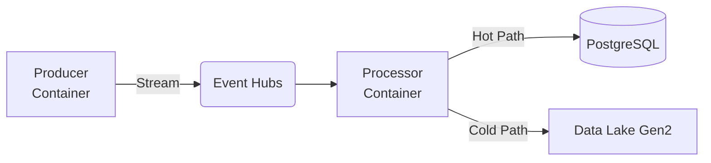

# Azure Real-Time Data Engineering Pipeline

Dieses Repository enthält den Quellcode für eine skalierbare **Microservice-Architektur** auf Microsoft Azure. Das System verarbeitet Datenströme in Echtzeit und implementiert eine **Lambda-Architektur** (Hot Path & Cold Path).


## 🏗 Architektur-Übersicht



Das System besteht aus zwei Docker-basierten Microservices, die in **Azure Container Apps** gehostet werden:
*   **Producer:** Simuliert einen Echtzeit-Datenstrom basierend auf Commit-Logs.
*   **Processor:** Konsumiert Events, archiviert Rohdaten (Data Lake) und schreibt aggregierte Metriken in eine Datenbank (PostgreSQL).

## 🛠 Technologie-Stack

*   **Cloud:** Microsoft Azure (Container Apps, Event Hubs, PostgreSQL Flexible Server, Data Lake Gen2)
*   **Code:** Python 3.9 (Libs: `azure-eventhub`, `sqlalchemy`, `pandas`)
*   **Containerization:** Docker & Azure Container Registry (ACR)
*   **Infrastructure:** Azure CLI

## 📂 Datengrundlage

Das Projekt nutzt den Datensatz **"Infected Code"** von Kaggle.
*   **Quelle:** [Kaggle Dataset](https://www.kaggle.com/datasets/prok2027/infected-code)
*   ⚠️ **Wichtig:** Aufgrund von GitHub-Dateigrößenbeschränkungen (>100MB) enthält dieses Repository nur eine gekürzte **Sample-Datei** (`src/producer/infected_code.csv`). Für den vollen Funktionsumfang muss die Originaldatei lokal eingefügt werden.

## 🚀 Setup & Deployment

1.  **Voraussetzungen:** Azure CLI, Docker, aktives Azure-Abonnement.
2.  **Infrastruktur:** Bereitstellung der Azure-Ressourcen via CLI.
3.  **Deployment:**
    ```bash
    # Build & Push
    az acr build --registry <RegistryName> --image producer:final ./src/producer
    az acr build --registry <RegistryName> --image processor:final ./src/processor
    
    # Deploy Container Apps
    az containerapp create ... --env-vars EVENT_HUB_CONN_STR="..."
    ```

